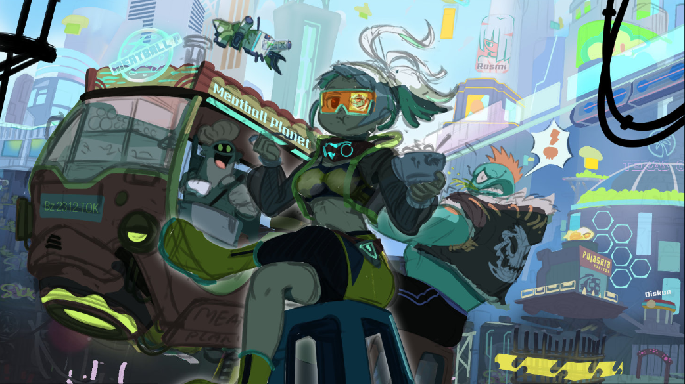
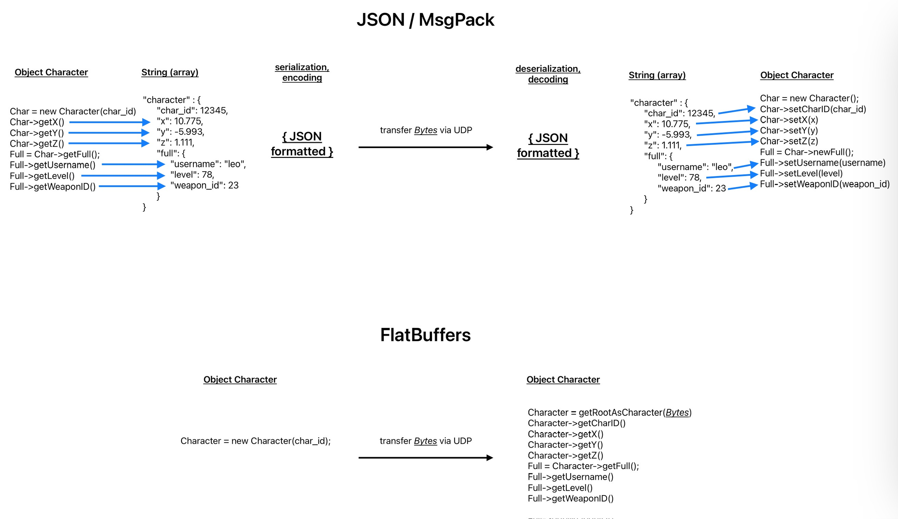
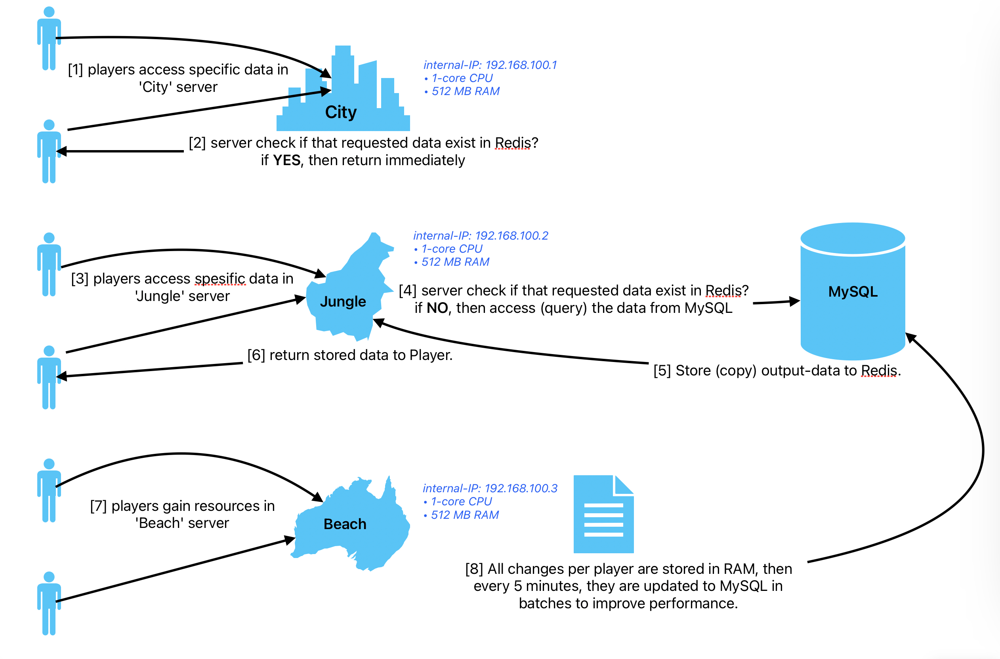

# Project Chain Quadrant "CQ" 



## Table of Contents

- [The Vision](#the-vision)
- [A different kind of MMORPG.](#a-different-kind-of-mmorpg)
- [Overview](#overview)
- [CQ’s CORE PILLARS](#cqs-core-pillars)
- [GAME CORELOOP](#game-coreloop)
- [OFF-CHAIN \& ON-CHAIN MMORPG](#off-chain--on-chain-mmorpg)
    - [The differences between OFF-CHAIN \& ON-CHAIN players:](#the-differences-between-off-chain--on-chain-players)
- [Why Web3 at CQ?](#why-web3-at-cq)
- [“X\&Jean”, the MMORPG Engine behind CQ](#xjean-the-mmorpg-engine-behind-cq)
    - [In-Depth System Architecture for Our MMORPG](#In-Depth-System-Architecture-for-Our-MMORPG)
        - [Server and Map Design](#Server-and-Map-Design)
        - [Performance and Maintenance Strategy](#Performance-and-Maintenance-Strategy)
    - [Data Handling and Communication](#Data-Handling-and-Communication)
        - [FlatBuffers](#FlatBuffers)
        - [Why FlatBuffers Wins:](#Why-FlatBuffers-Wins)
    - [Optimized Data Flow and Caching Strategy](#Optimized-Data-Flow-and-Caching-Strategy)
        - [Redis](#Redis)
        - [MySQL](#MySQL)
        - [Redis as Primary Data Access Layer](#Redis-as-Primary-Data-Access-Layer)
        - [Write Operations and Batch Update Mechanism](#Write-Operations-and-Batch-Update-Mechanism)
    - [Game Content Management and Updates](#Game-Content-Management-and-Updates)
        - [Storage and Retrieval of Assets](#Storage-and-Retrieval-of-Assets)
        - [Content Update Mechanism on Devices](#Content-Update-Mechanism-on-Devices)
        - [Benefits of Using Epoch Timestamps for Updates](#Benefits-of-Using-Epoch-Timestamps-for-Updates)
    - [Real-Time Engagement and Security](#Real-Time-Engagement-and-Security)
        - [Memcached for Security and Performance](#Memcached-for-Security-and-Performance)
        - [Push Notification System for Real-Time Engagement](#Push-Notification-System-for-Real-Time-Engagement)
        - [Synergy Between Memcached and Push Notifications](#Synergy-Between-Memcached-and-Push-Notifications)
    - [Conclusion on X&Jean MMORPG Engine](#Conclusion-on-X&Jean-MMORPG-Engine)     
- [Tokenomics](#tokenomics)
- [How to play the Game?](#how-to-play-the-game)
    - [1. Account Setup:](#1-account-setup)
    - [2. Character Creation:](#2-character-creation)
    - [3. Tutorial and Base Exploration:](#3-tutorial-and-base-exploration)
        - [Navigation:](#navigation)
        - [Base Features:](#base-features)
        - [Base Activities:](#base-activities)
    - [4. Battle in the Hunting Area:](#4-battle-in-the-hunting-area)
    - [5. First Time Play Experience](#5-first-time-play-experience)
- [Future Game Features](#future-game-features)
- [Rarities](#rarities)
    - [Equipment (Weapon \& Armor \& C.H.A.I.N)](#equipment-weapon--armor--chain)
    - [Pets](#pets)
    - [Characters](#characters)
- [Interoperability between Astha Games Titles](#interoperability-between-astha-games-titles)
    - [Project MM](#project-mm)
    - [Project AR](#project-ar)
    - [Project PLKR](#project-plkr)
- [Astha Studio Team](#astha-studio-team)
- [FAQ](#faq)


## The Vision

“To explore infinite possibilities of FUN”

Through ages, human being is wired to always find a way to explore FUN and that raw motivation is why a GAME is created. In the beginning, there was only a simple traditional game but then we, human being keeps coming up with a new way to create a new form of FUN. Now 2 millennia later, we already arrived at the age of Video games.

From a simple pixel that represents a tennis ball to a humble mustachio plumber who must jump around to save a damsel in distress and finally came along the advent of a new massive social interactive game genre that was later known as the MMORPG.
And here we are, as a firm believer in MMORPG media, we fully believe that such genre is an endless frontier to explore FUN. Not only as a social platform where player can enjoy their memorable adventure together, but as a media to explore a brand-new world that is always exciting and FUN. 

Now…allow us to take you to our world, a new MMORPG world that inspired from Southeast Asian region with some cyberpunk & sci-fi twist, a universe that we called the “Chain Quadrant”.

## A different kind of MMORPG.
Most MMORPGs that are available in the market right now are usually using medieval fantasy theme or a generic sci-fi as their go-to setting. 

However, in the world of Chain Quadrant, the game is taking its inspiration from different sources. From old classic anime such as “Cowboy Bebop” where the bounty hunter story narrative is accompanied with awesome Jazz soundtrack and a classic MMORPG gameplay approach from the 2000’s era like Ragnarok Online, SEAL Online and Runescape. 

It's no longer a secret that Southeast Asian (SEA) gamers community are one of the most passionate gamers around and the promising SEA market has been known to draw many well-known game studios to target SEA gamers in the past couple of years now. And for that reason, the game will also be crafted with SEA gamer demographic in mind. With the universe of Chain Quadrant, we also hope that the SEA player can embrace their Southeast Asian heritage from a new perspective and find their beloved cities with some Cyberpunk twist.

Both Free2Play and Passionate Investing players are both strong in SEA market and therefore the universe of Chain Quadrant is created to cater them in a world setting that they are already familiar with, but at the same time feels so fresh and new for other Global region player.

## Overview
-	Free2Play MMORPG with Southeast Asian gamers demographic in mind.
-	Narrative driven Quests with some comedic storyline approach.
-	No Pay-to-Win philosophy, all players must fight their way up all the same.
-	Depicting many Southeast Asian cities with cyberpunk and sci-fi twist.
-	Stylize Japanese Anime bounty hunter characters.
-	Special Rare Weapons & Cosmetics when connecting to Crypto Wallet.
-	Crypto Wallets are optional, Off Chain play plausible.
-	ChatGPT AI driven NPC characters that will blend naturally with the world.

## CQ’s CORE PILLARS
-	Web “Agnostic” Game, can be played in both OFF-CHAIN and ON-CHAIN.
-	Web3 is optional, but HIGHLY encouraged.
-	NFT Interoperability, can be used at other Astha’s game title.

Until recently, the Web3 Gaming trends still having its up and down and our team acknowledge that the adaptation and adjustment for ordinary Web2 / Traditional gamers to be able to jump into the Web3 gaming scene still have its many shares of challenges. 

With that in mind, we are aiming to create Chain Quadrant (CQ) to become easy to access even for traditional gamers and we hope that with some extra Web3 game elements will encourage them to try the Web3 part of the game. 

Some Web3 elements that will be incorporated into CQs are:
-	NFTs (helmets, “land” spaceship, “pet” drones, weapons, armors)
-	NFTs will allow special access (exclusive dungeons, exclusive emotes)
-	CQ’s NFT is interoperability to other Astha Studios’ titles.

The transition is hoped to be smooth and voluntarily as we don’t want to force players who are still sceptical and not really into Web3 Gaming, especially the SEA players who are not that familiar with the Web3 & Blockchain industry in general.

## GAME CORELOOP
1.	Get the Narrative Quest for your target from “Faction” party. 
2.	Hunt Criminal Target to get your reward and in-game money, “DIPS” or "$CQUAD" token as its premium currency.
3.	While hunting, you will gain some materials for your weapon upgrade.
4.	Exchange your DIPS & Materials to upgrade your standard equipment and for Premium Equipment will require "$CQUAD" as the main payment method.
5.	Level Up, Upgrade Skills and ready for more challenging Quests as new area within Chain Quadrant will be unlocked.
6.	Back to number 1.

## OFF-CHAIN & ON-CHAIN MMORPG
Chain Quadrant (CQ) will be able to be played in both OFF-CHAIN and ON-CHAIN, meaning that the player chooses to play the game without NFT or connecting into their crypto wallet, it still possible for them to play CQ nevertheless.

Without the web3 elements, the player will be playing in OFF-CHAIN mode. These OFF-CHAIN players will still be able to enjoy the game’s many features, however, they can only access normal type of equipment, pets, cosmetics, and some exclusive dungeons might not be accessible to them.

In other hand, ON-CHAIN player that purchased special NFT collectibles and connecting their crypto wallet might have a special access to different type of special premium equipment, premium pets, cosmetics with its unique traits.

The unique traits are mainly cosmetics and has its special lore within the CQ Universe and has a slightly better stats compared to their normal counterpart.

### The differences between OFF-CHAIN & ON-CHAIN players:
| OFF-CHAIN mode |	ON-CHAIN mode |
| --- | --- |
| In-Game Dips (name of the in-game currency)	| ($CQUAD) Token as premium currency |
| Normal Weapons	| Premium Cosmetic Weapon & Armor with lore |
| Normal Armor Set	| Premium Drone “Pets” with lore |
| Normal Pets, “Drone”	| Premium Emotes |
| Normal Emotes	| Spaceship “Land” NFT |

## Why Web3 at CQ?
MMORPG & Simulation genre is the best game genre candidate for Web3 features implementation.

-	Various high-level equipment or characters that can be converted to NFT.
-	Special NFT that can unlock special access / features.
-	CQ’s & MM’s NFT Interoperability can be use at future Astha games.
-	Voting through DAO to decide the next Major game features.
-	Revenue tax for any P2P transaction.
-	Transparent gameplay using Blockchain and Anti Cheat using Smart Contract & distributed ledger technology.
 
## “X&Jean”, the MMORPG Engine behind CQ
Understanding how difficult the development of MMORPG engine and after developing “X&Jean” for the past 3,5 years, we are confident that the development for this new MMORPG title, Chain Quadrant (“CQ”) can be deployed swiftly within 12-18 months (depends on the extra contents and new features complexity)

Besides the standard MMORPG function, such as Quests and Loot Hunting, the engine also already covers most monetization features as follows:

-	In-App item purchase (Limited Seasonal Equipment & Skins, Premium Consumable).
-	Subscription “Pay-to-progress” service.
-	P2P transaction tax (percentage).
-	Dynamic Ads of in-game billboard.
-	Gacha Loot Box.
-	Auction (rare new items generated from game, or tax for P2P)
-	Optional tournaments’ tickets.

## In-Depth System Architecture for Our MMORPG

### Server and Map Design

Our game world is segmented into various maps, each supported by multiple dedicated micro-servers. This distributed approach ensures that high player activity in one map does not negatively impact the performance of other maps. Each micro-server can be scaled independently to accommodate varying player loads, ensuring optimal resource allocation and minimizing latency.

### Performance and Maintenance Strategy

The system is designed with elasticity in mind, leveraging cloud services that allow our micro-servers to automatically adjust their resource allocations based on the current demand. This means that during peak times, servers can seamlessly scale up to maintain performance, and scale down during off-peak hours to conserve resources.

## Data Handling and Communication


### FlatBuffers

When it comes to managing game data, speed and efficiency are paramount. That's where FlatBuffers comes into play. Developed by Google, it's a high-performance serialization library, known for its speed advantages over competitors like Protocol Buffers, JSON, or XML when it comes to serialization and deserialization operations.

### Why FlatBuffers Wins:

- Access Speed: FlatBuffers is specifically designed for high performance. It allows us to read serialized data directly from a binary buffer without parsing or unpacking it first, which is a step required by many other serialization libraries. This direct access method is significantly faster and reduces the processing overhead.
- Memory Efficiency: Unlike other serialization libraries that require a separate unpacking step, thereby doubling memory requirements, FlatBuffers operates in-place. It eliminates the need for additional memory allocation, making it a leaner choice, particularly for memory-constrained environments.
- Flexibility: FlatBuffers schemas are forward and backward compatible — a feature that allows us to update the data schema without breaking binaries of older versions, providing us with the flexibility to evolve our game without compatibility issues.
- Cross-Platform: It supports code generation for multiple programming languages and platforms, a must-have for a multi-platform MMORPG like ours.

In the context of our MMORPG, the use of FlatBuffers means that game data is processed as quickly as possible, reducing latency, which is crucial for real-time player interaction and game mechanics. This gives us an edge over competing games that may use slower serialization methods, enhancing our game's performance and the overall user experience.

By incorporating FlatBuffers into our architecture, we ensure that our game is not just fast and responsive but also stands out in the competitive landscape due to its advanced use of technology. Here is our Character.fbs:

```
namespace UDP;

/// if 'state' is 0 (default), then Destroy that Char_id object (remove Character from render)
table Character {
   char_id: int = 0;
   x: float = 0.0;
   z: float = 0.0;
   rotation: float = 0.0;
   state: byte = 0;

   full: Full;
   chat: Chat;
   xtra: Xtra;
   pet: Pet;
   group: Group;

   base: Base;

   war: War;
   fitness: Fitness;
   subs_info: SubsInfo;
   buff_info: BuffInfo;
   skill_cd: SkillCD;
   potion_cd: PotionCD;
   xv_cd: XVskillCD;
   pet_milisec: int = -1;
   pot_id_used: byte = -1;
   reward: Reward;

   is_friend: bool = false;
}

/// if 'username' is NULL (default), then just ignore all of the rest (no change)
table Full {
   username: string;
   weapon_id: short = -1;
   weapon_plus: byte = -1;
   head_id: short = -1;
   head_plus: byte = -1;
   body_id: short = -1;
   body_plus: byte = -1;
   foot_id: short = -1;
   foot_plus: byte = -1;
   accessory_id: short = -1;
   accessory_plus: byte = -1;
   pet_id: byte = -1;
   gender: byte = -1;
   style: byte = -1;
   job_id: byte = -1;
   xvolve_id: byte = -1;
}

/// if new 'at' is changed from previous 'at': means update. but if 'at' is just the same then ignore update
table Chat {
   at: byte = -1;
   message: string;
   type: byte = 0;
}

/// if zero (0) means: just ignore (no change)
table Xtra {
   map_id: short = 0;
   time: byte = 0;
   ep_move: short = 0;
   level: short = 0;
   game_master: string;
}

/// for each parameter which has value -1 (default): means ignore (nothing updated) for that parameter
table Pet {
   is_mount: byte = -1;
   is_hungry: byte = -1;
}

/// if 'group_timestamp' is 0 (default): means ignore (no need to refresh API /group)
table Group {
   group_timestamp: byte = 0;
   invitation_group: int = 0;
   invitation_username: string;
   is_leader: bool = false;
   group_member: byte;
   group_max: byte;
}

/// only used when in Base, if 'at' is -1 (default): means ignore (nothing updated)
table Base {
   at: byte = -1;
   shop_id: short = 0;
   vending_title: string;
   fishing_spot_id: byte = 0;
   fish_caught: byte = -1;
}

/// starting from War to bottom is ONLY used when in Battle/PVP. Just ignore when in Base
/// but only War will always sent by server
table War {     
   state: short = 1;
   lock_id: int = 0;
   number: int = 0;
   damage_type: byte = 0;
   is_stun: bool;
   is_burn: bool;
   is_tired: bool;
   is_venom: bool;
   is_slow: bool;
   is_weaken: bool;
   is_dazzle: bool;
   is_buff: bool;
   enhance_id: byte = 0;
}
/// damage_type = 1:miss, 5:block, 10:crit, 8:effective, 9:ineffective, 18:crit-effect, 19:crit-ineffect

/// only used when in Battle/PVP.
table Fitness {     
   hp: int;
   mp: short;
   ep: short;
   max_hp: int;
}

/// for each parameter which has value 0: means don't show (hidden) for that attribute
table SubsInfo {
   exp_percent: byte;
   rate_percent: byte;
   party_percent: byte;
}

/// for each parameter which has value 0: means don't show blue +plus for that attribute
table BuffInfo {
   hp: short;
   mp: short;
   atk: short;
   mgc: short;
   def: short;
   crt: short;
   acc: short;
   eva: short;
}

/// if not NULL = update Skills’ Cooldown by Miliseconds left (match index by id)
table SkillCD {
   id: [ubyte];
   milisec: [int];
}

/// if not NULL = update Potions’ Cooldown by Miliseconds left (match index by id)
table PotionCD {
   id: [ubyte];
   milisec: [int];
   stock: [short];
}

/// if not NULL = update Xvolve Skills’ Cooldown by Miliseconds left (match index by id)
table XVskillCD {
   id: [ubyte];
   milisec: [int];
}

/// only show EXP bar if 'exp' & 'coin' are not 0. but always update 'exp_bar' every time received
table Reward {
   exp: [int];
   coin: [int];
   item_id: [byte];
   item_qty: [byte];
   exp_bar: float;
}

root_type Character;
```

## Optimized Data Flow and Caching Strategy

### Redis

Fine tuned Redis serves as our in-memory data store, functioning as a cache to handle frequent data access requests. When a piece of data is not present in Redis, it falls back to MySQL. Retrieved data is then stored in Redis for a set duration, reducing future access times and decreasing the load on the MySQL database.

### MySQL

MySQL is the backbone for our durable data storage. While Redis excels at speed, MySQL provides the reliability of a persistent storage system. By leveraging MySQL's robustness, we can ensure that user data and game state are consistently maintained.

### Redis as Primary Data Access Layer

Our system architecture uses Redis as the front-line database to facilitate rapid data retrieval. Redis is an in-memory data structure store that excels at high-speed transactions and can serve data with sub-millisecond latency. Here's how we've optimized data access:
- Read Operations: When a user requests data, the system first checks Redis. If the data is present (a cache hit), it's returned immediately, avoiding slower database lookups.
- Cache Miss and MySQL Lookup: If the requested data is not found in Redis (a cache miss), the system retrieves it from the persistent MySQL database. This operation has higher latency but is minimized in frequency.
- Data Caching Duration: Once the data is retrieved from MySQL, it is stored in Redis for one hour. This caching strategy significantly reduces the read load on MySQL, as subsequent access to this data within the hour will hit the cache in Redis.



## Write Operations and Batch Update Mechanism

Regarding write operations and data persistence:

- Write Operations: Changes and updates initiated by users are first written to Redis. This leverages Redis's speed and ensures the user experiences no delay in their actions being acknowledged by the system.
- Batch Update to MySQL: To maintain persistence and consistency, these changes are collected and written to MySQL in batches. We use prepared statements to enhance security and efficiency, as well as to manage database load effectively. Each user's data is batch-updated every one minute in the background asynchronously, striking a balance between real-time interaction and database performance.

By using this layered approach with Redis as a caching layer and MySQL for persistent storage, we maintain high data availability and performance. Redis serves as an efficient buffer to absorb the high-velocity read and write operations demanded by the game, while MySQL ensures long-term data integrity and consistency.

This setup provides a responsive gaming experience where the heavy lifting of data management is abstracted away, allowing players to immerse themselves in the game world without interruption.

## Game Content Management and Updates

In our MMORPG, we have a plethora of assets that constitute the game's universe—everything from character equipment, hairstyles, monster models, maps, background musics, icons, to the descriptive text for various in-game items and lore. These assets are dynamic and frequently updated to keep the game fresh, engaging, and free from bugs.

## Storage and Retrieval of Assets

- Centralized Asset Storage: All game assets are stored centrally on our servers. This centralized approach ensures that any updates or new content can be disseminated effectively across all game clients.
- Versioning with Epoch Flags: We employ epoch timestamps as a versioning strategy for these assets. An epoch timestamp is a long integer representing the number of seconds that have elapsed since January 1, 1970 (the Unix epoch). Here's how we use it:
    - Every time an asset is updated or added, it's assigned a new epoch timestamp, marking the precise moment of its creation or update.
    - The server maintains a manifest of assets with their corresponding epoch timestamps, effectively creating a version history.

## Content Update Mechanism on Devices
- Device Sync Check: When a player's device connects to the server, a sync check is initiated. The device sends its local asset manifest — a list of assets currently stored on the device along with their epoch timestamps — to the server.
- Determining Updates: The server compares the device's manifest against the latest server manifest. If it finds that the server has newer epoch timestamps for certain assets, it flags those assets as outdated on the device.
- Updating Process:
    - The server then sends only the updated or new assets to the player's device, tagged with the newer epoch timestamps.
    - This ensures that the device only downloads the assets that have changed since the last update, saving on bandwidth and speeding up the update process.
- Partial Updates: If the game is live when updates are being pushed, our system is designed to perform partial updates. This means that only the assets that have been changed or added are downloaded in the background without requiring a full game update or restart.

## Benefits of Using Epoch Timestamps for Updates
- Efficiency: This method is bandwidth-efficient since only the assets that are new or have been changed are transmitted to the user's device.
- Speed: It's a time-saving process, as players can continue playing the game while the update is happening in the background.
- Accuracy: Epoch timestamps provide a simple yet accurate way to ensure all players are on the latest version of the game content without confusion.
- Scalability: This system can scale well as the game grows, capable of managing the distribution of a large number of assets systematically.

By utilizing epoch timestamps to manage content updates, we ensure that our players experience the latest and greatest our game has to offer with minimal interruption. This method also maintains consistency across the game's ecosystem, ensuring every player has access to the same version of game assets.

## Real-Time Engagement and Security
Our platform employs a sophisticated approach to maintaining user engagement while also ensuring secure transactions through two key technologies: Memcached and a Push Notification System. Here’s how they work in tandem:

### Memcached for Security and Performance
- Security: Memcached is utilized to generate and store temporary, randomized tokens for users. These tokens are essential for verifying user actions within the game, providing a layer of security for transactions or any in-game changes that are sensitive.
- Performance: Given that Memcached is an in-memory caching system, it offers high-speed data retrieval, which is critical for operations that need to happen in real time, like in-game purchases or event participation. Its volatile nature ensures that the tokens are only available for a short period, reducing the risk of unauthorized use.

## Push Notification System for Real-Time Engagement
- Engagement: The push notification system is engineered to deliver real-time communication to players. By sending notifications with unique, randomized codes directly to the user's device, the game can initiate specific actions such as opening new game levels, awarding daily bonuses, or starting limited-time events.
- Seamless User Experience: When a notification is received, the embedded code interacts with the game client to perform the intended action without the need for manual user input. This creates a seamless and interactive user experience, keeping players connected and immersed in the game world.

## Synergy Between Memcached and Push Notifications
The integration between Memcached and the push notification system establishes a robust framework for real-time engagement:
- When a critical operation is needed, a token is generated in Memcached and associated with a specific action.
- A push notification containing the corresponding code is sent to the user's device.
- Upon receiving the notification, the device communicates with the game server, passing along the token for validation.
- Memcached quickly validates the token, the action is authorized, and the user experiences instant feedback within the game.

This architecture ensures that time-sensitive operations are executed swiftly and securely, enhancing the gameplay experience while also maintaining the integrity of user transactions and in-game activities.

## Conclusion on X&Jean MMORPG Engine.

This architecture provides a robust framework that is not only resilient to spikes in player activity but also maintains consistent performance across different maps within the game. It’s a finely-tuned system that meets the demands of a dynamic MMORPG environment while ensuring data security and providing the infrastructure for a seamless and immersive gaming experience.

## Tokenomics
Astha Studio will offer ITO (Initial Token Offering) and proposed DAO (Decentralized Autonomous Organization) to involve the community on its development roadmap.

- Initial Token Offering (ITO)
    -	$0,1 -> $0,5 -> $1 /token.
-	$TOKEN as premium currency
    -	Special Items & NFTs Purchase.
    -	Withdraw ONLY by reputation.
-	NFT items with random traits
    -	Rare traits = high price NFT
-	Interoperability NFTs
    -	can be used at other Astha titles (MM, PLKR, future titles)
-	Decentralized Autonomous Organization (DAO) opportunity.
    -	Big $CQUAD holder can decide the game’s next big features.

## How to play the Game?
**User Guide: Navigating the Web3 MMORPG**

This guide will provide you with a comprehensive overview for the gameplay experience on mobile (Android and iOS). The game screen orientation will be using horizontal orientation.

### 1. Account Setup:
Start your journey by logging in with your email and securing your account with a one-time password (OTP).

### 2. Character Creation:
Develop a unique character profile, including:
-	**Character Name**: Must be distinct among all other players.
-	**Gender**: Choose between Male or Female.
-	**Hairstyle**: Select from 8 options for both male and female.
-	**Job**: Choose your role (Blockpunk, Sharpeye, Webmancer, and Nethiver)
    -	**Blockpunk**: Focuses on close range combat, they use different melee weapons to deal greater damage while risking their HP. Good as Tank type character.
    -	**Sharpeye**: Guns afficionado, experts in multiple types of guns. They attack enemies from distances and with some good armor, they can handle some damage as their HP lower compared to the Blockpunks.
    -	**Webmancer**: Master of cyberware and able to create massive damage while they hacked through their enemies’ tech. They are very weak when face straight on by their enemies and has the lowest HP rate.
    -	**Nethiver**: A cyberpunk doctors who are good in fixing tech and cyberware implant alike. Their knowledge in fixing things makes them great at healing and support skills that help other job classes.

### 3. Tutorial and Base Exploration:
Arrive at the base, a secure zone free from monsters, where various activities await.

#### Navigation:
-	Utilize the left joystick for movement.
-	Swipe the screen to rotate the camera.
-	Explore the map in the upper left for detailed area information.
-	Time and day cycles (morning, afternoon, evening, and night) are displayed alongside the map.
-	Engage in chat using the chat box in the lower area.

#### Base Features:
-	**Quest**: Daily missions for valuable rewards.
-	**Stories**: Uncover the rich narrative behind the game world.
-	**Ranking**: Compare your achievements with fellow players.
-	**Guild**: Form alliances and collaborate with other players.
-	**Item Mall**: Acquire usable items, subscriptions, costumes, and lucky boxes using $CQUAD (in-game currency purchasable with real money).
-	**Profile**: Access your character profile, including Dips (in-game currency), email, server, user ID, and subscription details.
-	**Settings**:
    -	**Gameplay**: Customize language, minimap rotation, camera inversion, notifications, and sensitivity.
    -	**Graphic**: Adjust between 2D/3D interfaces, graphic quality, FPS limit, and display resolution.
    -	**Audio**: Toggle music and sound effects on/off.
-	**Social**: Add friends and form groups.
-	**Pet**: Purchase pets and utilize them in both city commuting and battles.
-	**Inventory**:
    -	**Equipment**: Change costumes and weapons.
    -	**Potion**: Utilize potions for various battle boosts.
    -	**Item**: Manage gems, usable, and more.
    -	**Chip**: Enhance battle capabilities.
    -	**Food**: Contains pet food and plants.
-	**Status**: Monitor character, experience, and stats.
-	**Equipment Set**: Test chip effects.
-	**Level Point**: Increase character strength using Level Point.
-	**Skills**: Enhance battle skills using Skill Point.
-	**Switch**: Switch between characters.
-	**C.H.A.I.N Armor Activation**: Activate it on difficult enemies.
-	**Equipment Durability**: Damaged weapon will decrease its effectiveness.
-	**Multiple Cities & Dungeon**: each with its unique characteristics.

#### Base Activities:
-	**Farming**: Cultivate diverse plants in available crop fields, ensuring daily care for a fruitful harvest.
-	**Vending**: Facilitate player-to-player trading.
-	**Trash Fishing**: Engage in fishing activities at the trash dump to earn rewards.
-	**Talk with NPC**: Undertake quests by interacting with non-player characters.
    -	**Subway Station**: Instantly transport to other locations, including different bases and hunting areas.
    -	**BHG**: A Bounty Hunter Guild that sells weapons & armor.
    -	**Governor of CQ**: Unlock a second class and embark on additional quests.

### 4. Battle in the Hunting Area:
Engage in battles against various monsters in hunting areas, each featuring different monster types and unique day/night cycles.

### 5. First Time Play Experience
1.	The Player will first need to download the game from the GooglePlay, Appstore or designated app store.
2.	After downloading the game, the player then sets up their account and gets their OTP from their registered email address.
3.	The loading screen while the game is downloading will show environment like in cyberpunk airport immigration. It shows the counter window where the immigration officer usually posted is, but the window is still closed with the roll blinds and notes “Be back after Lunch!”.
4.	Once the download process is completed, the counter window suddenly opens, and an attractive cyberpunk immigration lady officer asked to move forward.
5.	The cyberpunk immigration officer then asked the player to take a picture where at this phase, the player can decide their avatar looks inside the game and job class that they want to pick.
6.	After the player decides their avatar looks and job class, a cutscene showing the lady immigration officer acknowledges that the player is another new bounty hunter in the city of New Jakarta.
7.	She then provides C.H.A.I.N (Computerized Henshin Applicator Interoperability Neckwear), D.O.P.E (Dimensional Ordinance Pocket Entrapment) and B.L.A.S.T (Bounty List Assistant Secure Tracker) to the player’s character.
8.	The Player’s character then enters the city of New Jakarta for the first time and the B.L.A.S.T will then inform the player to check the bounty hunter board to start checking the criminal list in front of CQPD.
9.	The Player will be asked to pick a novice criminal for his/her tutorial phase.
10.	After selecting the criminal, B.L.A.S.T will inform the player to visit BHG and once the player reaches & gets inside the guild, the cute lady behind the weapon counter will then offer the player a beginner weapon.
11.	After the player has their equipment with them, the player will then be asked to go to the nearest subway ticket machine to be transported to a tutorial area where they will start their first hunt.
12.	At the tutorial area, the player will then need to defeat several small enemies in the area first, before the boss (criminal that they player hunt) will appear.
13.	Once the boss is defeated, the player will use their D.O.P.E to capture the criminal.
14.	The Player then needs to get back to the bounty hunter board list at CQPD where they put their D.O.P.E inside the machine and in return, they’ll get their bounty hunting reward.
15.	And after that, the player can start hunting other new criminals from the bounty hunter board again and upgrade their equipment along the way at the BHG.
16.	At later stage, the bounty target will be moving from one area to another at random time after they get enough damage.
17.	However,if the player has the "Spaceship" NFT, the CriT radar from their spaceship can help determine where & when the bounty target will appear next.
18.	The Bounty Target HP will be quite high and only player that has contribute the highest damage (by keep tracking their bounty till the end) that can catch the bounty after the bounty target is incapacitated.   

## Future Game Features
-	“Land” Spaceship NFT: Bounty Hunter Base of Operation, bonus upgrade from your own “base” and use special your "Cri.T (Criminal Tracker) radar" to track your bounties earlier. (as long you keep upgrading your ship's Cri.T Radar)
-	“Reputation”: Only Bounty Hunter with stellar reputation can withdraw $CQUAD produced from their journey.
-	High level Equipment Minting to NFT: Once an equipment reaches “+20” status, the player can decide to mint that equipment to become an NFT.
-	High level Characters Minting to NFT: Once the character reaches Level 60, the player can decide to mint their character to become an NFT.

## Rarities
### Equipment (Weapon & Armor & C.H.A.I.N)
-	Common: No extra chip clots + No Bonus Stats + Lowest durability.
-	Uncommon: +1 Chip Slot + Low Durability.
-	\[NFT] Rare: +2 Chip Slot + Minor Bonus Stats + Good Durability.
-	\[NFT] Super Rare: +3 Chip Slots + Major Bonus Stats + Best Durability.
### Pets
-	Second Hand Drones = No additional bonus stats.
-	Brand New Drones = Minor Bonus Traits.
-	\[NFT] Limited Edition Drones = Limited Drone Skins + Major Bonus Traits.
### Characters
-	Non NFT / Normal: No access to Special Exclusive Dungeon. 
-	\[NFT] Special LVL 60: Special Access to Exclusive Dungeon.

 
## Interoperability between Astha Games Titles

Planned future Interoperability between Astha Games Projects:

### Project MM
At CQ: Access to Idol café to enjoy special performance that will result in random bonus stats.

From CQ: Unlock new special concert venues.

### Project AR
At CQ: Meeting Allie character from AR where she will tell you bonus stories.

From CQ: Unlock special “Power Up” shoes that will double steps count for an hour.

### Project PLKR
At CQ: New Area Access, “the Mall” where the player will be able to meet some characters from PLKR and access new Quests from them.


From CQ: New Accessories & Pets for PLKR characters.
 
## Astha Studio Team
Astha Studio Team are consisting of different talents that already working at both video games and entertainment industries for 15++ years and counting. The team realized that they are first gamer, before becoming developers and “FUN” will be always the core above all else.

Our Ideals are simple, “to create a game so fun but fair at the same time” that if we are the player of that game, we don’t feel cheated by it. There are games to be developed and revenue to be made so we can keep going in developing FUN products but again we will always keep in mind to please the players that we hope can be our community fan base, especially in Southeast Asian region.

As games without its players who support them are nothing! We really acknowledge that gamers are all smart people that can be hard to pleased, but when they became a fan, they’ll be supporting the games and studio who created them with passion.

The following are the members behind Astha Studio:

Ronald Widjaya (CEO)

Ronald Widjaya always believes video games as the leading & powerful Entertainment media. He loves the narrative driven video games and RPG is his favourite genre. Starts as a Game Designer back in 2006, however ended up as a Game Producer to this very day, for him, to create a game product that everyone loves and leaving a legacy through the media has always been something that drives him in this industry.


Juleo Barakutama (CTO)

Born in Jakarta, an avid gamer ever since he was at high school. Juleo decided to study on how to make video games out of his love towards the media. The time, he started developing his own game, he realized that the nostalgic element of a classic MMORPG is something that the market still interested in. Hence, his journey started to create an MMORPG engine that are versatile yet lightweight. 


Michael “Mickey” Marudut (CMO)

For Mickey, games within the realm of web3 have garnered considerable attention, owing to their pivotal role in shaping the gaming industry's future. Gaming stands out as a captivating form of entertainment during moments of leisure. Furthermore, gaming serves as a valuable alternative for reflection during periods of fatigue and stress, offering a refreshing escape for those seeking respite from the demands of everyday life.

## FAQ

**What is “Chain Quadrant”?**

Chain Quadrant is an open world MMORPG where you play as a Space Bounty Hunter and your journey starts at the fictional cyberpunk Southeast Asia inspired city of New Jakarta. Your job as a bounty hunter is not easy but tons of high-tech weapon arsenal will be available for you as the game progresses.


**What makes Chain Quadrant different from another MMORPG alike?**

Most MMORPGs that are available in the market right now are usually using medieval fantasy theme or a generic sci-fi as their go-to setting. However, in the world of Chain Quadrant, the game is taking its inspiration from different sources. From old classic anime such as “Cowboy Bebop” where the bounty hunter story narrative is accompanied with awesome Jazz soundtrack and a classic MMORPG gameplay approach from the 2000’s era with comedic approach for its narrative.


**Who own Chain Quadrant?**

The game is developed and owned by Astha Studio, we are a game studio from Jakarta, Indonesia. Before developing Web3 Games, the development team are coming from Web2 Games industry, and we understand that the gameplay and its core loop should be our game’s main attraction before all else. We acknowledge that Web3 gaming scene nowadays still facing many steep challenges, but nevertheless we want to make a Web3 game that is not only fun but fair on its monetization scheme.


**What do you mean by OFF-CHAIN and ON-CHAIN gameplay?**

Chain Quadrant (CQ) will be able to be played in both OFF-CHAIN and ON-CHAIN. Without the web3 elements, the player will be playing in OFF-CHAIN mode and play the game without NFT or connecting into their crypto wallet. In other hand, ON-CHAIN player can obtain special NFT collectibles that bound into the game lore by purchasing it using their crypto wallet.


**When will the game to be released?**

Using our X&Jean MMORPG engine, we are confident that by Q4 2025, we will already have the Closed Beta of CQ ready. However, for our Pre-Alpha gameplay is currently under development and we hope it will be ready by Q3 2024. Things might go faster with additional support from VC and partners along the way in the future.


**On which Platform will the Chain Quadrant be release?**

We aimed to release the game on mobile first as the mobile platform version has a wider outreach. Later, we will consider releasing for the PC platform as well.


**Is Chain Quadrant a Pay-to-win game?**

Nope! At the end of the day, for the players to progress, they still need to play the game nevertheless like everyone else. There will be a level requirement for powerful weapons and equipment so even if a player get some weapon or equipment by purchasing it from the game or another player, they still must level up their game character accordingly to be able to use such powerful equipment.
